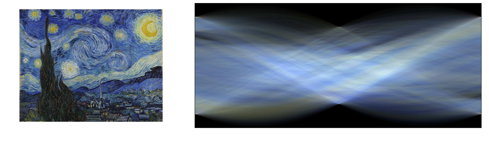
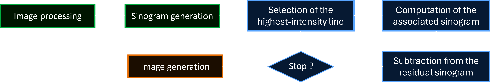
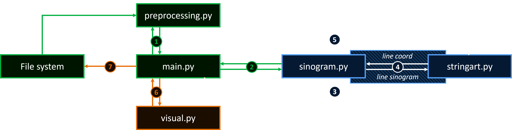
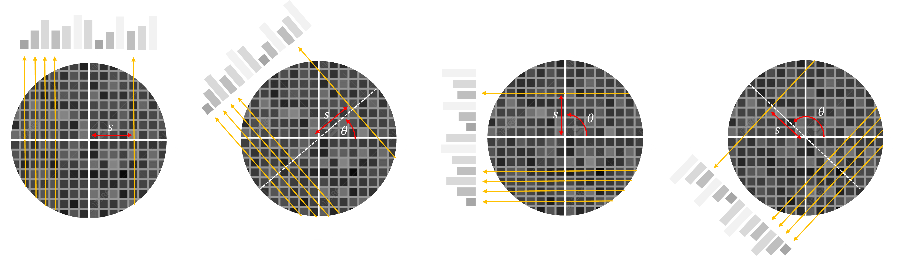
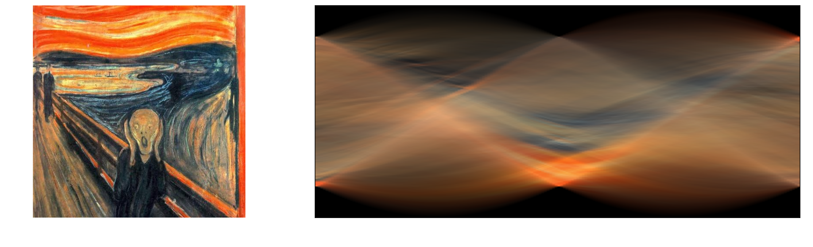

# String Art using the Radon transform
**String Art generator based on a custom implementation of the Radon transform.**

**Inspired by tomography and medical imaging**, this project reconstructs images through an iterative analysis of their **residual sinogram**. Unlike traditional greedy approaches based on Bresenham's algorithm, this approach doesn't operate directly on the image. Instead, it works in the sinogram domain where the lines contributing the most to the reconstruction can be identified through a geometric interpretation.

<br/>

Project highlights :
-  Built entirely in Python, using `NumPy`, `Matplotlib` and `Pillow`
-  The Radon transform and sinogram generation are implemented from scratch.
-  Supports grayscale, RGB and CMYK images (*high res examples in the output directory*).
-  Typical  runtime : 10 to 20 seconds (*for 10 000 lines on a 200 × 200 image*).

<br/>

> **Remark :** This program generates discontinuous lines and is therefore not directly suitable for physical fabrication. However, the algorithm can be adapted to produce a continuous line sequence (*see [discussion](#Future-improvements)*).

<br/>


<br/>

## Table of Contents 
- [Project overview](#Project-overview)
- [Project architecture](#Project-architecture)
- [Installation & Usage](#installation-&-Usage)
- [Discrete Radon transform and sinograms](#Discrete-Radon-transform-and-sinograms)
- [Analytical Radon transform](#Project_architecture)
- [Future improvements](#Future-improvements)

<br/>

## Project Overview

This program uses the Radon transform to analyze the contribution of image lines across all possible angles, generating the image's **sinogram : a 2D representation of the accumulated pixel intensities along projected lines**, defined by their polar coordinates *(i.e., their angle and distance from the origin)*.

<br/>

> **Remark :** the intensity refers to the numerical value carried by pixels, representing their brightness or color information. Depending on the image format, this value corresponds to grayscale intensity or to the combination of color channels (*RGB or CMYK values*).

<br/>



<br/>

The algorithm then iterates on this sinogram (*instead of the image*) :
1. Select the line with the highest intensity,
2. Compute the sinogram of the selected line,
3. Subtract the line's sinogram from the image's sinogram.

<br/>

The program therefore exploits the residual sinogram until either the desired number of lines is reached or the sinogram has been completely depleted. The selected lines are then drawn in reverse order, starting from the last selected lines. This ensures that the first selected lines *(the most intense ones)* remain on the surface of the final representation *(affecting only color images)*.

<br/>



<br/>

> **Remark :** another way to see this is to consider that the final artwork starts as a blank canvas, (*so its sinogram is empty*). The residual sinogram is the difference between the image's sinogram and the (*still empty*) output's sinogram, it's therefore, at first, simply equal to the image's own sinogram. Each time a line is added, its sinogram is subtracted from this residual sinogram, bringing the output's sinogram progressively closer to the original one.

<br/>

## Project Architecture

The project is organized into several modules, each responsible for a specific part of the reconstruction pipeline. The `main.py` file serves as the entry point and orchestrates the entire workflow by sequentially calling the functions defined in the different modules :

- `preprocessing.py`: image loading, preprocessing operations *(image color modifications, croping...)*, and initialization of required variables
- `sinogram.py`: Radon transform computation and generation of sinograms for both images and individual lines
- `stringart.py`: iterative line selection, line sinogram computation, and residual sinogram subtraction
- `visual.py`: generation and display of the different visualizations

<br/>



<br/>


## Installation & Usage
Clone the repository, access it and install the dependencies :

```bash
git clone https://github.com/ThetaMogwai/String-Art-and-Radon-transform.git
cd String-Art-and-Radon-transform
pip install -r requirements.txt
```

The program behavior is controlled by 3 configuration dictionaries at the top of the`main.py` file : `IMAGE_CONFIG`, `QUALITY_CONFIG`, and `OUTPUT_CONFIG`.

```python
IMAGE_CONFIG = {
    'name': 'image.jpg',   # Name of the image, located in the /input folder
    'color': 'CMYK',       # Color mode: 'RGB', 'CMYK', or 'L' (grayscale)
    'invert': True,        # Invert grayscale channels for 'L' / 'CMYK' images
    'circular': True,      # Crop and apply a circular mask to the image
}

QUALITY_CONFIG = {
    'image_size': 200,     # Lower resolution to increase generation speed
    'n_projections': 180,  # Number of angles used for the Radon transform
    'n_lines': 8000,       # Maximum number of lines generated
    'contrast': 1.5,       # Grayscale contrast enhancement for 'CMYK' images
}

OUTPUT_CONFIG = {
    'sinogram': False,     # Display the sinogram
    'string_art': True,    # Display the final result
    'comparison': False,   # Display a comparison of the image and result
}
```

<br/>

The figures below illustrate the influence of each parameter on the reconstruction quality. Based on my testing, the following settings provide a good balance between image quality and computation time :

- **Number of lines:** 4,000–8,000 for grayscale images, and up to **15,000** for CMYK images.
- **Image size:** target around **200 × 200** pixels. Higher resolutions improve the level of detail but increase computation time and typically require more lines to achieve a comparable reconstruction.
- **Number of projections:** around **180** projection angles, which generally provide sufficient angular resolution to avoid artifacts without significantly increasing the computational cost.

<br/>


<br/>

## Discrete Radon transform and sinograms

>The **Radon transform** is a mathematical operation that **computes line integrals of a 2D function along parallel paths at various angles**.

<br/>

Applied to an image, the Radon transform measures how pixel intensity accumulates when projected along a set of parallel straight lines across the image and onto a virtual detector positioned at the edge of the image.

Each projection line is uniquely defined by its polar coordinates $(\theta, s)$ and verify the following equation : 
-  $s$  : the perpendicular distance between the projection line and the origin,
-  $\theta$  : the angle between the line's normal vector and the \(x\)-axis.

$$\mathcal{L}(\theta,s) \quad x \times \cos(\theta) + y \times \sin(\theta) = s \qquad \qquad \theta \in [0,\pi]\quad  s \in [-R, R]$$

<br/>

Sweeping $\theta$ over $[0, \pi]$ makes these lines cover every possible orientation, equivalent to rotating the detector fully around the image while recording one projection per angle (*or rotating the image while the detector if fixed*). Stacking these projections side by side produces the sinogram.

> **Remark:** Computed Tomography (CT) scanners rely on the same principle : they acquire successive X-ray projections while rotating around the patient.



<br/>

Thus the produced **sinogram is essentially a map of line intensities** : a 2D image whose horizontal axis is the angle $\theta$ and vertical axis is the position $s$, where each pixel stores the accumulated intensity along the corresponding line. 

The brighter a point in the sinogram, the more intense the pixels crossed by that line in the original image. The algorithm exploits this property by repeatedly selecting the maximum value of the **residual sinogram**. 

Each selected maximum identifies the projection line contributing the most to the remaining image. Its corresponding sinogram is then computed and subtracted from the residual sinogram before the process is repeated.



>**Remark:** In this illustration, imagine a horizontal detector positioned above the image. At the initial angle, the orange line on the right of the image is projected onto a small region of the detector, producing the intense orange pixels visible in the lower-left corner of the sinogram.
>
>As the detector rotates counterclockwise around the image, the projection of this line is spread across the detector, tracing the characteristic sinusoidal curve.
>
>Around the middle of the sinogram, the projection direction has rotated by approximately 90°, meaning that the detector is now integrating the image from left to right. The bright orange region corresponds to the orange sky at the top of the painting, while the blue region immediately above it corresponds to the sea lying beneath the sky.

<br/>

## Radon Transform Implementation
### General idea

There are two main approaches to implementing the discrete Radon transform :
- **Rotate the detector:** keep the image fixed and project every pixel onto a rotating detector.
- **Rotate the image:** rotate the image and sum the pixel values along a fixed direction.

<br/>

Although conceptually simpler, the second approach is more expensive as rotating an image requires an inverse mapping and 2D interpolation of every pixel for each projection angle. 

Furthermore, computing the sinogram of an individual line with this method would be highly inefficient, since the image would be mostly empty (*except a few pixels*), while still requiring the same amount of computation.

<br/>

This project therefore adopts the first approach, which can be divided into 3 successive steps :

1. **Projection :**
For a given angle `theta`, each pixel `x,y` is projected onto the detector, with `s` the projection coordinate given by : `s = x * np.cos(theta) + y * np.sin(theta)`

The resulting `s` values are continuous and indicate where each pixel is projected on the detector (*with 0 as the center of the detector*).

<br/>

2. **Interpolation :** 
However, detector bins correspond to integer coordinates (*the rows of the sinogram*), whereas the projected coordinates `s` are continuous. 

	Instead of assigning a pixel entirely to the nearest detector bin, its intensity is distributed between the two neighboring bins (`lower_bin` and `upper_bin`). This 1D interpolation reduces discretization artifacts in the resulting sinogram.

<br/>

3. **Accumulation :**
Finally, the interpolated contributions of every pixel are accumulated inside the corresponding detector bins, producing one column of the sinogram.

<br/>

### Vectorized implementation

A straightforward implementation would iterate over every pixel for every projection angle which is far too slow in pure Python. For a **200 × 200** image and **180** projection angles, this would require more than **7 million pixel projections**, each involving trigonometric operations, interpolation and accumulation.

Instead, this implementation completely removes the pixel-level loop by exploiting NumPy vectorization, eliminating millions of Python-level iterations while preserving exactly the same numerical result. Full code [here](sinogram.py)

<br/>

The pixel coordinates (`x_coord` and `y_coord`) centered on the center of the image are stored as two-dimensional arrays covering the entire image.

``` python
x_coords, y_coords = np.meshgrid(np.arange(width), np.arange(height))

x_coord = x_coords - center_x
y_coord = center_y - y_coords
```

<br/>

Then, for a given projection angle, the projection coordinates of **all pixels** are computed simultaneously using a single vectorized expression:

``` python
for i, theta in enumerate(angles):
	projection = x_coord * np.cos(theta) + y_coord * np.sin(theta)
	projection += s_radius   # convert coord to detector array indexes
```

<br/>

Likewise, the interpolation weights, lower detector bins and upper detector bins are all computed simultaneously for every pixel without any explicit Python loop through the pixels

``` python
	lower_bin = np.floor(projection).astype(int)
	upper_bin = lower_bin + 1
	
	for j in range(image.shape[2]):   # iterate through color channel
		weight = projection - lower_bin 
		lower_value = (1 - weight) * image[:, :, j]
		upper_value = weight * image[:, :, j]    
```

<br/>

Rather than iterating over the pixels and updating the detector one value at a time, the vectorized implementation relies on `numpy.bincount`: summing all contributions sharing the same detector index.

``` python
		lower_count = np.bincount(lower_bin.ravel(), weights=lower_value.ravel(), minlength=s_diameter)
		upper_count = np.bincount(upper_bin.ravel(), weights=upper_value.ravel(), minlength=s_diameter)
		        
		sinogram[:, i, j] = lower_count + upper_count
```

<br/>

### Chord-length normalization (circular images only)

Since the string art frame is circular, only pixels inside the inscribed circle of radius `R` are relevant. But the chord length crossed by a projection line varies with its distance `s` from the center.

Without correction, this creates a systematic bias : central lines cross far more pixels than peripheral ones, so they accumulate a higher total intensity. The algorithm would then favor long central lines because of their geometry, not because they actually cross brighter regions.

To remove this bias, each detector bin is divided by the analytical chord length 
of the circle at that position, given by : `length(s) = 2 * np.sqrt(R**2 - s**2)`

This turns the raw accumulated intensity into an **average intensity** (*a number independent of how long the line is*).

```python
projection_length = np.linspace(-image_radius, image_radius, image_diameter + 2)[1:-1]
projection_length = 2 * np.sqrt(image_radius**2 - projection_length**2)

sinogram = sinogram / projection_length[:, None, None]
```

<br/>

> **Remark :** `linspace` is generated with two extra points, then its first and last values are dropped to remove endpoints. Because the chord length at the edge would be zero.

<br/>

## Future improvements

**Continuous thread generation.** The current algorithm selects, at each iteration, the single best line independently of the one drawn before and the resulting sequence isn't a single continuous thread that could be physically wound around nails without cutting it. 

<br/>

Supporting this would (*probably*) require two changes :
* Adjust the number of detector bin and center them on the nails, so that every bin of the sinogram corresponds to exactly one real nail (instead of the arbitrary one bin per pixel). Interpolation would then distribute each pixel's contribution across these nail-defined bins rather than a uniform integer grid.

<br/>

* Restrict the search for the next line to bins whose starting nail matches the ending nail of the previously selected line. This requires precomputing, for every bin of the sinogram, which pair of nails it corresponds to. For each starting nail, this defines a curve through the  sinogram passing through every line compatible with it — the candidates to choose the next line from. Alternatively, the whole sinogram could be remapped into columns grouping lines by their starting nail, though this might be more computationally intensive.

<br/>
<br/>

**Color accuracy.** Colors are currently generated by working on each channel (`RGB` or `CMYK`) independently, which means several overlapping lines are often needed to reconstruct a given color through superposition. 

When drawing a line, its color could instead be read directly from the sinogram rather than processing one channel at a time. This would improve color accuracy and reduce the number of lines required to reach a given result (possibly combined with adjusting line width and alpha).